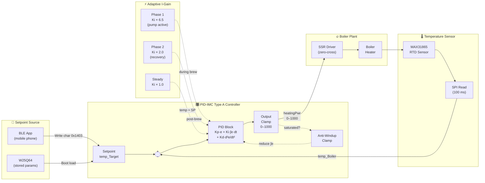
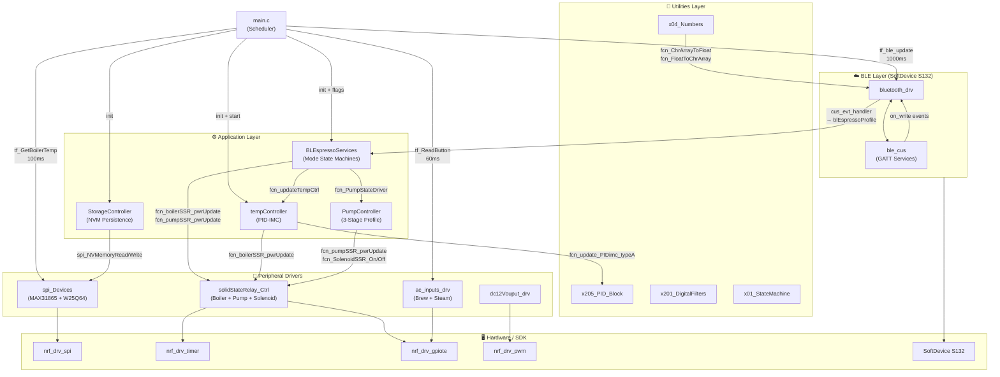
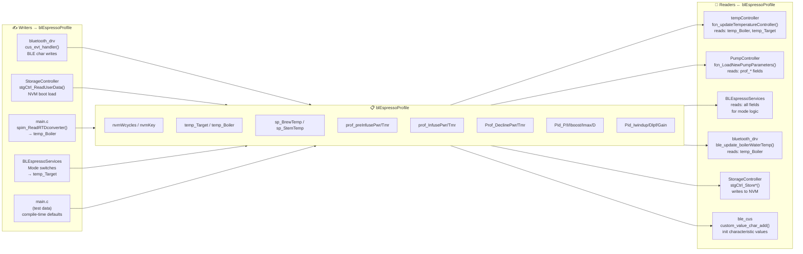

# Module Architecture — BLEspresso Controller

This document maps every module in the BLEspresso embedded application: peripheral drivers, utilities, BLE services, application-layer controllers, and the main scheduler. All file paths are relative to `ble_espresso_app/`.

---

## 1. Mid-Level Peripheral Drivers (`components/Peripherals/`)

### 1.1 spi_Devices (.c / .h)

| Attribute | Detail |
|---|---|
| **Role** | SPI bus master — drives two slave devices on shared SPI instance 1 |
| **Devices** | MAX31865 RTD-to-digital converter (boiler temp), W25Q64FV serial flash (NVM) |
| **SPI Config** | Mode 3, MSB-first, 1 MHz, software chip-select |
| **Key Functions** | |
| `spim_init()` | Configure SPI peripheral, init CS/WP/HOLD pins |
| `spim_initRTDconverter()` | Write config register `0xD1` → VBIAS on, auto-conversion, 3-wire, 50 Hz filter |
| `spim_ReadRTDconverter()` | Non-blocking 2-state read: (s0) start SPI xfer, (s1) on completion compute temperature using Callendar–Van Dusen quadratic |
| `f_getBoilerTemperature()` | Return last computed temperature (encapsulated float) |
| `spim_initNVmemory()` | Reset NVM + read JEDEC ID; validate manufacturer `0xEF` |
| `spi_NVMemoryRead()` | 24-bit addressed sequential read |
| `spi_NVMemoryWritePage()` | Sector erase + page program (up to 256 B) |
| **Internal State Machine** | `StateMachineCtrl_Struct sm_SPIdevices` — arbitrates multi-step SPI transactions |
| **Dependencies** | nRF SPI driver (`nrf_drv_spi`), GPIO driver (`nrf_drv_gpiote`) |

### 1.2 ac_inputs_drv (.c / .h)

| Attribute | Detail |
|---|---|
| **Role** | Debounced AC switch sensing for Brew and Steam toggle switches |
| **Method** | GPIO edge-counting: ISR increments counter on each AC zero-crossing toggle; periodic logic evaluates count vs. threshold |
| **Key Functions** | |
| `fcn_initACinput_drv()` | Configure two GPIOTE inputs (toggle, high-accuracy) with ISR handlers |
| `fcn_SenseACinputs_Sixty_ms()` | Called every 60 ms — evaluates both inputs using `fcn_acInputLogic()` |
| `fcn_GetInputStatus_Brew()` | Returns `AC_SWITCH_ASSERTED` or `AC_SWITCH_DEASSERTED` |
| `fcn_GetInputStatus_Steam()` | Returns `AC_SWITCH_ASSERTED` or `AC_SWITCH_DEASSERTED` |
| **ISR Handlers** | `acinBrew_eventHandler()`, `acinSteam_eventHandler()` — increment per-pin counters |
| **Logic** | If counter > previous threshold → asserted; counter becomes new threshold each evaluation cycle |

### 1.3 solidStateRelay_Controller (.c / .h)

| Attribute | Detail |
|---|---|
| **Role** | Controls three SSR outputs: boiler heater, pump motor, solenoid valve |
| **Boiler SSR** | Configurable: `ANGLE` (phase-angle firing via HW timer) or `ZERO_CROSS` (cycle-skipping). Current config: `ZERO_CROSS` |
| **Pump SSR** | Phase-angle control via HW timer 1 |
| **Solenoid SSR** | Simple on/off GPIO |
| **Power Range** | 0–1000 (fixed-point ×10, i.e. 0.0–100.0 %) |
| **Key Functions** | |
| `fcn_initSSRController_BLEspresso()` | Init all three SSR instances + zero-cross detector |
| `fcn_boilerSSR_pwrUpdate(power)` | Set boiler heater power |
| `fcn_pumpSSR_pwrUpdate(power)` | Set pump motor power |
| `fcn_SolenoidSSR_On()` / `fcn_SolenoidSSR_Off()` | Toggle solenoid |
| `get_SolenoidSSR_State()` | Query solenoid engagement status |
| **ISR Handlers** | `isr_ZeroCross_EventHandler` (GPIOTE), `isr_BoilderSSR_EventHandler` (Timer), `isr_PumpSSR_EventHandler` (Timer) |
| **HW Resources** | Timer 1 (pump), Timer 2 (boiler in ANGLE mode), GPIOTE for zero-cross input |

### 1.4 dc12Vouput_drv (.c / .h)

| Attribute | Detail |
|---|---|
| **Role** | PWM-based 12 V high-side switch output |
| **Usage** | Drives a lamp or 12 V accessory via PWM |
| **Key Function** | `fcn_initDC12Voutput_drv()` → returns `DRV_12VO_INIT_AS_LAMP` on success |
| **HW Resource** | nRF PWM peripheral (`nrf_drv_pwm`) |

### 1.5 board_comp_drv (.c / .h)

| Attribute | Detail |
|---|---|
| **Role** | Board companion — buttons and LEDs for development board (PCA10040) |
| **Usage** | Development / debugging only |

### 1.6 i2c_sensors (.c / .h)

| Attribute | Detail |
|---|---|
| **Role** | TMP006 IR temperature sensor via I²C |
| **Status** | Present in code but **unused** in the current application |
| **HW Resource** | TWI (I²C) peripheral |

---

## 2. Utilities (`components/Utilities/`)

### 2.1 x01_StateMachineControls (.h)

| Attribute | Detail |
|---|---|
| **Role** | Defines generic state-machine control structure used across all modules |
| **Struct** | `StateMachineCtrl_Struct { sPrevious, sRunning, sNext }` |
| **Constants** | `STATE_MACHINE_RUNNING`, `STATE_MACHINE_IDLE` |
| **Used By** | spi_Devices, PumpController, BLEspressoServices |

### 2.2 x02_FlagValues (.h)

| Attribute | Detail |
|---|---|
| **Role** | Boolean-like constants and saturation enums |
| **Defines** | `ACTIVE` / `NOT_ACTIVE`, `POSITIVE_SATURATION` / `NEGATIVE_SATURATION` / `NO_SATURATION` |

### 2.3 x03_MathConstants (.h)

| Attribute | Detail |
|---|---|
| **Role** | Mathematical constants (π, e, etc.) |

### 2.4 x04_Numbers (.c / .h)

| Attribute | Detail |
|---|---|
| **Role** | Numeric conversion utilities |
| **Key Functions** | |
| `fcn_Constrain_WithinFloats()` | Clamp float within ±limit; returns saturation flag |
| `fcn_FloatToChrArray()` | Convert float to ASCII char array (for BLE characteristic values) |
| `fcn_ChrArrayToFloat()` | Convert char array to float (for BLE RX parsing) |

### 2.5 x201_DigitalFiltersAlgorithm (.c / .h)

| Attribute | Detail |
|---|---|
| **Role** | First-order RC low-pass filter (software implementation) |
| **Key Functions** | `lpf_rc_calculate_const()`, `lpf_rc_filter()` |
| **Struct** | `lpf_rc_param_t` — filter state and coefficients |
| **Used By** | PID Block (optional D-term filtering) |

### 2.6 x205_PID_Block (.c / .h)

| Attribute | Detail |
|---|---|
| **Role** | Reusable PID controller library |
| **Variants** | |
| `fcn_update_PID_Block()` | Standard textbook PID with optional D-term LPF |
| `fcn_update_PIDimc_typeA()` | **IMC Type A** — textbook PID with anti-windup (used by this app) |
| `fcn_update_PIDimc_typeB()` | IMC Type B — derivative acts on PV only (not SP) |
| **Anti-windup** | Clamping scheme: when output saturates, integral error is reduced by `I_error -= I_error × dt` |
| **Structs** | `PID_Block_fStruct` (classic), `PID_IMC_Block_fStruct` (IMC) |
| **Time Tracking** | Delta-time computed from millisecond tick difference (`TimeMilis` field) |

---

## 3. BLE Services (`components/BLE/` and `components/BLE_Services/`)

### 3.1 bluetooth_drv (.c / .h)

| Attribute | Detail |
|---|---|
| **Role** | BLE stack initialization and event routing |
| **Device Name** | `"BLEspresso"` |
| **Manufacturer** | `"PaxsElectronics"` |
| **SoftDevice** | S132 (BLE 5.0) |
| **Key Functions** | |
| `BLE_bluetooth_init()` | Full BLE init chain: power mgmt → stack → GAP → GATT → services → advertising → conn params → peer manager |
| `advertising_start()` | Start BLE advertising (fast mode) |
| `ble_disconnect()` | Terminate active connection |
| `ble_update_boilerWaterTemp()` | Send boiler temperature as notification (float → 4-char ASCII) |
| **Event Handler** | `cus_evt_handler()` — dispatches BLE write events to `blEspressoProfile` fields |
| **Data Flow (RX)** | BLE write → `cus_evt_handler()` → parse via `fcn_ChrArrayToFloat()` → write to `blEspressoProfile.*` |
| **Data Flow (TX)** | `blEspressoProfile.temp_Boiler` → `ble_update_boilerWaterTemp()` → BLE notification |
| **Flags** | `flg_BrewCfg` (set after all brew params received), `flg_PidCfg` (set after all PID params received) |

### 3.2 ble_cus — Custom GATT Service (`components/BLE_Services/`)

| Attribute | Detail |
|---|---|
| **Role** | Defines two custom GATT services with all characteristics |
| **UUID Base** | `f364adc9-b000-4042-ba50-05ca45bf8abc` |
| **Services** | |

#### BLEspresso Service (UUID `0x1400`)

| Characteristic | UUID | Access | Description |
|---|---|---|---|
| Machine Status | `0x1401` | Read + Notify | Espresso machine state string |
| Boiler Water Temp | `0x1402` | Read + Notify | Current boiler temperature |
| Boiler Target Temp | `0x1403` | Read + Write | Brew temperature setpoint |
| Steam Target Temp | `0x140A` | Read + Write | Steam temperature setpoint |
| Pre-Infusion Power | `0x1404` | Read + Write | Pre-infusion pump % |
| Pre-Infusion Time | `0x1405` | Read + Write | Pre-infusion seconds |
| Infusion Power | `0x1406` | Read + Write | Infusion pump % |
| Infusion Time | `0x1407` | Read + Write | Infusion seconds |
| Decline Power | `0x1408` | Read + Write | Decline pump % |
| Decline Time | `0x1409` | Read + Write | Decline seconds |

#### PID Service (UUID `0x1500`)

| Characteristic | UUID | Access | Description |
|---|---|---|---|
| P Term | `0x1501` | Read + Write | Proportional gain |
| I Term | `0x1502` | Read + Write | Integral gain |
| I Max | `0x1503` | Read + Write | Integral limit |
| I Windup | `0x1504` | Read + Write | Anti-windup enable |
| D Term | `0x1505` | Read + Write | Derivative gain |
| D LPF | `0x1506` | Read + Write | D-term filter cutoff |
| Gain | `0x1507` | Read + Write | Overall gain |

### 3.3 BLE/BLEspressoServices (.c / .h) — BLE-side struct definition

| Attribute | Detail |
|---|---|
| **Role** | Defines `bleSpressoUserdata_struct` and declares the global `blEspressoProfile` variable |
| **Note** | There are two versions of this header (under `components/BLE/include/` and `components/Application/`). The Application version adds `sp_BrewTemp`, `sp_StemTemp`, `Pid_Iboost_term` fields not in the BLE version. |

---

## 4. Application Layer (`components/Application/`)

### 4.1 BLEspressoServices (.c / .h) — Application-side

| Attribute | Detail |
|---|---|
| **Role** | Top-level mode state machines — the core application logic |
| **Owns** | `blEspressoProfile` (global volatile struct containing all runtime parameters) |
| **Modes** | |

#### Classic Mode — `fcn_service_ClassicMode(swBrew, swSteam)`
Called every 100 ms. Simple on/off espresso operation.

| State | Trigger | Actions |
|---|---|---|
| `cl_idle` | Brew asserted | Solenoid ON, Pump 100%, I-gain boost (×6.5), → `cl_Mode_1` |
| `cl_idle` | Steam asserted | Set target = steam temp, → `cl_Mode_2` |
| `cl_Mode_1` | Brew released | Pump OFF, I-gain → ×2.0, Solenoid OFF, → `cl_idle` |
| `cl_Mode_2` | Steam released | Target = brew temp, → `cl_idle` |
| `cl_Mode_3` | Both → release one | Return to idle |

Temperature controller runs every 500 ms within the service tick (`SVC_MONITOR_TICK`).

#### Profile Mode — `fcn_service_ProfileMode(swBrew, swSteam)`
Uses exponential ramp tables for smooth 3-stage pressure profiling:
1. **Pre-infusion** — ramp to `prof_preInfusePwr` over configurable time
2. **Infusion** — ramp to `prof_InfusePwr`
3. **Decline** — ramp down to `Prof_DeclinePwr`

#### Step Function Mode — `fcn_service_StepFunction(swBrew, swSteam)`
Diagnostic mode entered by holding both switches at power-on:
- 30 s delay → apply 100% heater → log temperature every 0.5 s for PID tuning

### 4.2 tempController (.c / .h)

| Attribute | Detail |
|---|---|
| **Role** | PID-IMC boiler temperature controller |
| **PID Type** | IMC Type A (`fcn_update_PIDimc_typeA`) |
| **Default Gains** | Kp = 9.52156, Ki = 0.3, Kd = 0.0, I-limit = 100.0 |
| **Adaptive I-Gain** | |
| Phase 1 (pump active) | Ki × 6.5 via `fcn_loadIboost_ParamToCtrl_Temp()` |
| Phase 2 (post-brew recovery) | Ki × 2.0 via `fcn_multiplyI_ParamToCtrl_Temp()` |
| Steady state | Ki × 1.0 (reverted when temp within 1 °C of target) |
| **Timing** | 1 ms HW timer (Timer 3) provides millisecond ticks; PID calculates dt from tick delta |
| **Key Functions** | |
| `fcn_initCntrl_Temp()` | Init PID profiles (main, phi1, phi2) + start 1 ms HW timer |
| `fcn_loadPID_ParamToCtrl_Temp()` | Copy BLE-received gains into active PID struct |
| `fcn_updateTemperatureController()` | One PID iteration: read PV + SP from `blEspressoProfile`, return heater power (0–1000) |
| **Profiles** | Three `PID_IMC_Block_fStruct` instances: `sctrl_profile_main`, `sctrl_profile_phi1` (brew boost), `sctrl_profile_phi2` (recovery) |

### 4.3 PumpController (.c / .h)

| Attribute | Detail |
|---|---|
| **Role** | Multi-stage pump pressure profiling |
| **Stages** | Idle → Solenoid Close → Ramp to 1st → Hold 1st → Ramp to 2nd → Hold 2nd → Ramp down to 3rd → Hold 3rd → Ramp to Stop |
| **Timing** | State machine runs every 100 ms (via `fcn_PumpStateDriver()`) |
| **Ramp** | Linear slope calculated from power delta / ramp-time (default 2.5 s ramp up/down) |
| **Defaults** | Pre-infusion: 35% / 6 s, Peak: 100% / 5 s, Decline: 80% / 6 s |
| **Key Functions** | |
| `fcn_initPumpController()` | Load default profile parameters |
| `fcn_LoadNewPumpParameters()` | Recalculate slopes/timings from `blEspressoProfile` brew profile |
| `fcn_PumpStateDriver()` | Execute one state-machine step (100 ms tick) |
| `fcn_StartBrew()` | Begin pump sequence |
| `fcn_CancelBrew()` | Jump to ramp-down-to-stop |

### 4.4 StorageController (.c / .h)

| Attribute | Detail |
|---|---|
| **Role** | Persist user parameters to external W25Q64 flash via SPI |
| **Key Functions** | |
| `stgCtrl_Init()` | Reset + identify NVM |
| `stgCtrl_ChkForUserData()` | Read magic key to check for existing data |
| `stgCtrl_ReadUserData()` | Load 65-byte block into `blEspressoProfile` |
| `stgCtrl_StoreShotProfileData()` | Write brew profile section (preserves controller section) |
| `stgCtrl_StoreControllerData()` | Write PID section (preserves shot profile section) |
| **Memory Layout** | See [external_mem.md](../mem/external_mem.md) |

---

## 5. Main (`main/main.c`)

### 5.1 Initialization Sequence

```
main()
├── 1. log_init()                       [if NRF_LOG_ENABLED]
├── 2. nrf_drv_gpiote_init()            GPIO driver
├── 3. timers_init()                    app_timer (20 ms software tick)
├── 4. spim_init()                      SPI bus
├── 5. stgCtrl_Init()                   External NVM reset + ID
├── 6. stgCtrl_ChkForUserData()         Check magic key
├── 7. stgCtrl_ReadUserData()           Load blEspressoProfile from NVM
├── 8. spim_initRTDconverter()          MAX31865 configuration
├── 9. fcn_initDC12Voutput_drv()        12V PWM output
├──10. fcn_initACinput_drv()            Brew/Steam GPIO interrupts
├──11. fcn_initSSRController_BLEspresso() SSR timers + zero-cross
├──12. fcn_initPumpController()         Pump default params
├──13. fcn_LoadNewPumpParameters()      NVM → Pump (if data loaded)
├──14. fcn_initCntrl_Temp()             PID profiles + 1 ms HW timer
├──15. fcn_loadPID_ParamToCtrl_Temp()   NVM → PID (if data loaded)
├──16. fcn_loaddSetPoint_ParamToCtrl_Temp()  Set brew SP
├──17. Detect mode (both switches → Tune, else → App)
├──18. application_timers_start()       Start 20 ms tick
├──19. BLE_bluetooth_init()             Full BLE stack + services
├──20. advertising_start()              Begin BLE advertising
└──21. fcn_startTempCtrlSamplingTmr()   Enable 1 ms HW timer
```

### 5.2 Scheduler — Flag-Based Cooperative Loop

The 20 ms app_timer ISR sets flags. The `for(;;)` main loop polls them:

| Task Flag | Period | Action |
|---|---|---|
| `tf_ReadButton` | 60 ms | `fcn_SenseACinputs_Sixty_ms()` — debounce AC inputs |
| `tf_GetBoilerTemp` | ~100 ms | `spim_ReadRTDconverter()` + store in `blEspressoProfile.temp_Boiler` |
| `tf_svc_EspressoApp` | 100 ms | `fcn_service_ClassicMode()` or `fcn_service_ProfileMode()` (if App mode) |
| `tf_svc_StepFunction` | 100 ms | `fcn_service_StepFunction()` (if Tune mode) |
| `tf_ble_update` | 1000 ms | `ble_update_boilerWaterTemp()` — BLE notification |

### 5.3 Mode Selection

At startup, if both Brew and Steam switches are asserted → **Tune mode** (step function for PID tuning). Otherwise → **App mode** (Classic or Profile espresso operation).

---

## 6. Temperature Controller — PID-IMC Control System Diagram



---

## 7. Main Interaction — Layer View



---

## 8. `blEspressoProfile` — Central Data Hub

The global variable `blEspressoProfile` (type `bleSpressoUserdata_struct`) is the shared data hub connecting BLE, storage, and all application controllers.


