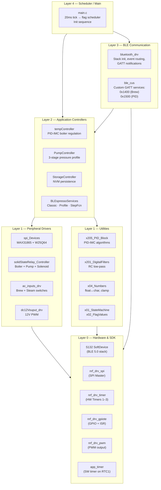
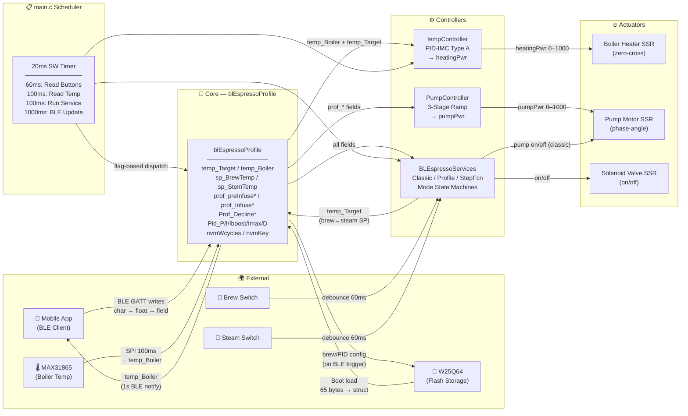
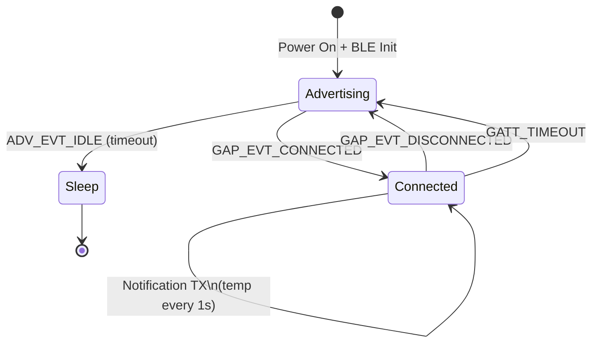

# System Design — BLEspresso Controller

This document describes the overall system design of the BLEspresso Gaggia Classic controller using two complementary architectural views: **Layer View** and **Component-Interaction View**.

---

## Layout 1 — Layer View

The system is organized into five horizontal layers. Each layer depends only on the layer(s) below it. The `blEspressoProfile` global struct acts as a shared data bus visible to the Application and BLE layers.



### Layer Descriptions

| Layer | Name | Responsibility |
|---|---|---|
| **L0** | Hardware & SDK | Nordic nRF5 SDK 17.1.0 drivers and S132 SoftDevice. Treated as black boxes. |
| **L1** | Peripheral Drivers + Utilities | Hardware abstraction: SPI temp sensor/flash, SSR control, AC switch debounce, PWM. Reusable math: PID, filters, number conversion. |
| **L2** | Application Controllers | Domain logic: temperature PID regulation, pump profiling, NVM persistence, espresso mode state machines. |
| **L3** | BLE Communication | BLE stack management, custom GATT service definitions, data serialization for mobile app interface. |
| **L4** | Scheduler / Main | System initialization, cooperative flag-based scheduling (20 ms tick), mode selection. |

---

## Layout 2 — Component-Interaction View (Data-Centric)

This view shows how components interact through the central `blEspressoProfile` data hub, emphasizing data producers, consumers, and control flow.



---

## Key Design Decisions

### 1. Cooperative Scheduling (No RTOS)

The system uses a single-threaded super-loop with flag-based task dispatch driven by a 20 ms app_timer. This eliminates context-switch overhead and stack-per-task memory costs — critical on the nRF52832's 64 KB RAM.

**Trade-off:** All task code must be non-blocking. The SPI temperature read uses a 2-state machine to avoid blocking on SPI transfers.

### 2. Central Data Hub (`blEspressoProfile`)

All user-configurable state lives in one global volatile struct. This simplifies:
- BLE ↔ application parameter passing (write directly to fields)
- NVM serialization (one struct maps to one memory page)
- Controller updates (single pointer parameter)

**Trade-off:** No mutex protection — safe here because the scheduler is cooperative (no preemption between tasks) and BLE writes happen in SoftDevice context which preempts but writes to distinct fields.

### 3. Adaptive PID I-Gain

The PID controller adapts its integral gain based on brew state:
- **×6.5 during brew** — compensates for heat loss to cold water flowing through the boiler
- **×2.0 post-brew** — accelerates recovery to target temperature  
- **×1.0 at steady state** — normal regulation

This avoids integral windup during transient thermal loads without requiring a full gain-scheduling framework.

### 4. Zero-Cross SSR Control for Boiler

The boiler heater uses zero-cross cycle-skipping rather than phase-angle control. This produces less EMI and is gentler on the heating element. The pump uses phase-angle control for smoother pressure modulation.

### 5. Exponential Ramp Tables for Profile Mode

Rather than computing exponentials in real-time, the profile mode uses pre-computed lookup tables (`a_expGrowth[]`, `a_expDecay[]`) with 14 entries. This provides smooth S-curve transitions with minimal CPU cost.

### 6. Independent NVM Sections

The W25Q64 user data block is split into Shot Profile (32 B) and Controller (25 B) sections. Each can be updated independently via read-modify-write, reducing flash wear by ~50% compared to always writing the full block.

---

## Timing Summary

```
Time →
├─ 0 ms     ── SW Timer tick ──────────────────────────
├─ 20 ms    ── SW Timer tick
├─ 40 ms    ── SW Timer tick
├─ 60 ms    ── SW Timer tick + tf_ReadButton (AC debounce)
├─ 80 ms    ── SW Timer tick
├─ 100 ms   ── SW Timer tick + tf_GetBoilerTemp + tf_svc_EspressoApp + tf_svc_StepFunction
├─ 120 ms   ── SW Timer tick + tf_ReadButton
├─ ...
├─ 500 ms   ── (inside service) SVC_MONITOR_TICK → run PID + log
├─ ...
├─ 1000 ms  ── SW Timer tick + tf_ble_update → BLE notification
└─ ...repeat...
```

### ISR Timing (Background)

| ISR | Source | Period | Purpose |
|---|---|---|---|
| `isr_HwTmr3_Period_EventHandler` | Timer 3 | 1 ms | Millisecond tick for PID dt calculation |
| `isr_ZeroCross_EventHandler` | GPIOTE | ~8.33 ms (120 Hz) | AC zero-cross → SSR control |
| `acinBrew_eventHandler` | GPIOTE | ~8.33 ms | Brew switch edge counting |
| `acinSteam_eventHandler` | GPIOTE | ~8.33 ms | Steam switch edge counting |
| `isr_PumpSSR_EventHandler` | Timer 1 | Variable | Pump SSR phase-angle trigger |

---

## BLE Connection Lifecycle



On connection:
1. Mobile app can read all characteristic values (initialized from `blEspressoProfile`)
2. Mobile app enables notifications on char `0x1401` (status) and `0x1402` (temperature)
3. Mobile app writes brew/PID parameters → `cus_evt_handler` updates `blEspressoProfile`
4. Device sends temperature notifications every 1 second
