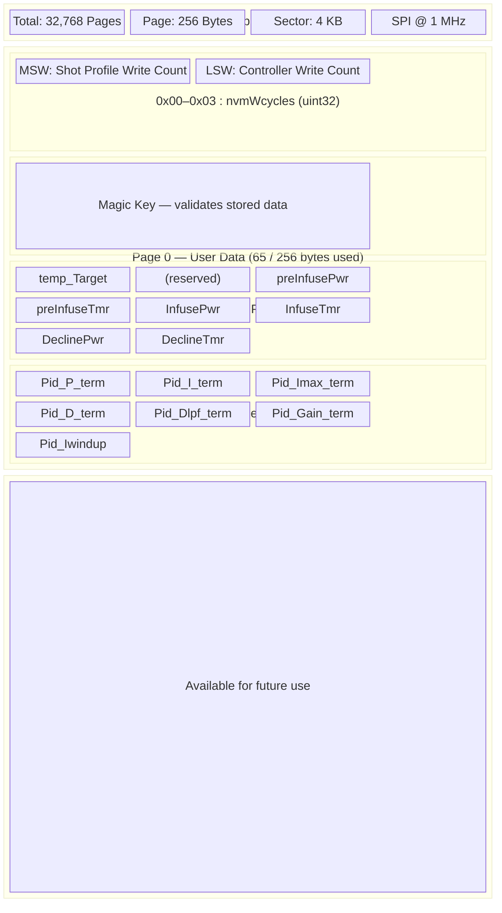

# External Memory Map — W25Q64FV (64M-bit Serial Flash)

## Device Overview

| Property | Value |
|---|---|
| Part Number | W25Q64FV |
| Manufacturer | Winbond (JEDEC MFR ID: `0xEF`) |
| Device ID (SPI mode) | `0x4017` |
| Total Capacity | 64 Mbit (8 MB) |
| Page Size | 256 bytes |
| Sector Size | 4 KB (16 pages) |
| Block Size (32K) | 32 KB |
| Block Size (64K) | 64 KB |
| Total Pages | 32,768 |
| Total Sectors | 2,048 |
| Interface | SPI (Mode 0 / Mode 3), up to 104 MHz |

## SPI Pin Configuration (nRF52832)

| Signal | nRF52 Pin | Description |
|---|---|---|
| CS | GPIO 15 (`SPI_NVM_CS_PIN`) | Chip select (active low) |
| WP | GPIO 17 (`SPI_NVM_WP_PIN`) | Write protect (active low) |
| HOLD | GPIO 18 (`SPI_NVM_HD_PIN`) | Hold (active low, pauses SPI) |
| MOSI | `SPI_MOSI_PIN` | Shared SPI bus with MAX31865 |
| MISO | `SPI_MISO_PIN` | Shared SPI bus with MAX31865 |
| SCK | `SPI_SCK_PIN` | Shared SPI bus, 1 MHz |

> **Note:** The NVM shares the SPI bus (instance 1) with the MAX31865 RTD sensor. Chip-select pins provide device isolation.

## Memory Layout — Application Usage

The application stores all user-configurable data (brew profile + PID parameters) on **Page 0** of the flash. Only 65 bytes of the 8 MB device are actively used.

### Page 0 — User Data Block (65 bytes)

| Byte Address | Size | Field | Type | Description |
|---|---|---|---|---|
| `0x00`–`0x03` | 4 B | `nvmWcycles` | `uint32_t` | Write-cycle counter — MSW: Shot profile writes, LSW: Controller writes |
| `0x04`–`0x07` | 4 B | `nvmKey` | `uint32_t` | Magic key `0x00AA00AA` — if present, data is valid; `0xFFFFFFFF` = empty |
| `0x08`–`0x0B` | 4 B | `temp_Target` | `float` | Brew target temperature (°C) |
| `0x0C`–`0x0F` | 4 B | *(reserved)* | — | Reserved / unused (`0x00000000`) |
| `0x10`–`0x13` | 4 B | `prof_preInfusePwr` | `float` | Pre-infusion pump power (0–100.0 %) |
| `0x14`–`0x17` | 4 B | `prof_preInfuseTmr` | `float` | Pre-infusion duration (seconds) |
| `0x18`–`0x1B` | 4 B | `prof_InfusePwr` | `float` | Infusion pump power (0–100.0 %) |
| `0x1C`–`0x1F` | 4 B | `prof_InfuseTmr` | `float` | Infusion duration (seconds) |
| `0x20`–`0x23` | 4 B | `Prof_DeclinePwr` | `float` | Decline pump power (0–100.0 %) |
| `0x24`–`0x27` | 4 B | `Prof_DeclineTmr` | `float` | Decline duration (seconds) |
| `0x28`–`0x2B` | 4 B | `Pid_P_term` | `float` | PID proportional gain (Kp) |
| `0x2C`–`0x2F` | 4 B | `Pid_I_term` | `float` | PID integral gain (Ki) |
| `0x30`–`0x33` | 4 B | `Pid_Imax_term` | `float` | PID integral limit |
| `0x34`–`0x37` | 4 B | `Pid_D_term` | `float` | PID derivative gain (Kd) |
| `0x38`–`0x3B` | 4 B | `Pid_Dlpf_term` | `float` | PID D-term low-pass filter cutoff |
| `0x3C`–`0x3F` | 4 B | `Pid_Gain_term` | `float` | PID overall gain |
| `0x40` | 1 B | `Pid_Iwindup_term` | `bool` | Anti-windup enable flag |

**Total: 65 bytes** (of a 256-byte page)

### Logical Sections Within User Data

```
Page 0 (256 bytes)
├── Write-Cycle Section  [0x00–0x03]  4 bytes
├── Key Section          [0x04–0x07]  4 bytes
├── Shot Profile Section [0x08–0x27] 32 bytes  ← Written by stgCtrl_StoreShotProfileData()
├── Controller Section   [0x28–0x40] 25 bytes  ← Written by stgCtrl_StoreControllerData()
└── Unused               [0x41–0xFF] 191 bytes
```

### Mermaid Diagram — Memory Map



### Write Procedure

1. **Read** the entire 65-byte user data block from Page 0.
2. **Check** the magic key at `0x04`:
   - `0x00AA00AA` → data exists; preserve unchanged sections.
   - `0xFFFFFFFF` → first write; embed the key.
3. **Increment** the appropriate write-cycle counter in `nvmWcycles`.
4. **Encode** updated float values into the TX buffer.
5. **Erase** the sector (4 KB) containing Page 0.
6. **Write** the full 65-byte block back via `spi_NVMemoryWritePage()`.

> **Important:** The W25Q64 requires a sector erase before page programming. The driver erases the first sector (`spi_NVMemoryEraseSector(0)`) before each write.

### NVM Commands Used by the Application

| Command | Opcode | Purpose |
|---|---|---|
| Reset Enable | `0x66` | Prepare for software reset |
| Reset | `0x99` | Software reset device |
| Read JEDEC ID | `0x9F` | Identify manufacturer + device |
| Write Enable | `0x06` | Unlock write operations |
| Write Disable | `0x04` | Lock write operations |
| Read Data | `0x03` | Sequential read from address |
| Page Program | `0x02` | Write up to 256 bytes |
| Sector Erase | `0x20` | Erase 4 KB sector |
